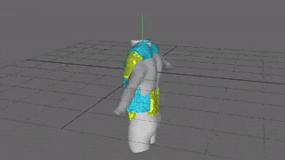

# PositionBasedDynamics (with SMPL)

## Preview

## Build Instructions

1. First, start with the original [upstream](https://github.com/InteractiveComputerGraphics/PositionBasedDynamics). Consult the original build doc and see if you can 1) scaffold the project, 2) run the demos and 3) build the python package in **a vanila state**.

2. If you managed to compete the steps above, try cloning this fork and repeating the same process.

3. Locate the demo project named "SMPLCollisionDemo" and see if it runs. You will need to specify the path to the SMPL model asset in the code before running the demo.

4. Locate a client project named "pypbd" and see if it builds. If so, you should be able to find the built artifact somewhere (`build/lib/**`) in the build directory with a name like "pypbd.cp{*}-win_amd64.pyd".

5. ...Profit!

Last updated: April 4, 2024

## References
- [PositionBasedDynamics](https://github.com/InteractiveComputerGraphics/PositionBasedDynamics) - PositionBasedDynamics is a library for the physically-based simulation of rigid bodies, deformable solids and fluids. 
- [smplxpp](https://github.com/sxyu/smplxpp) - Super fast SMPL/+H/-X implementation in C++, with CUDA support and a built-in OpenGL renderer 